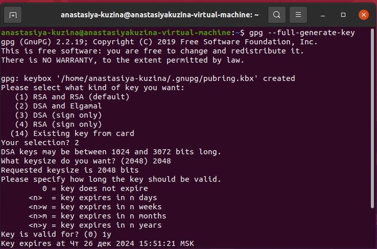
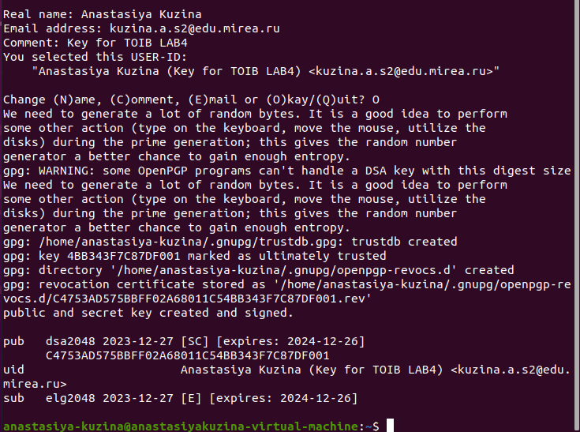
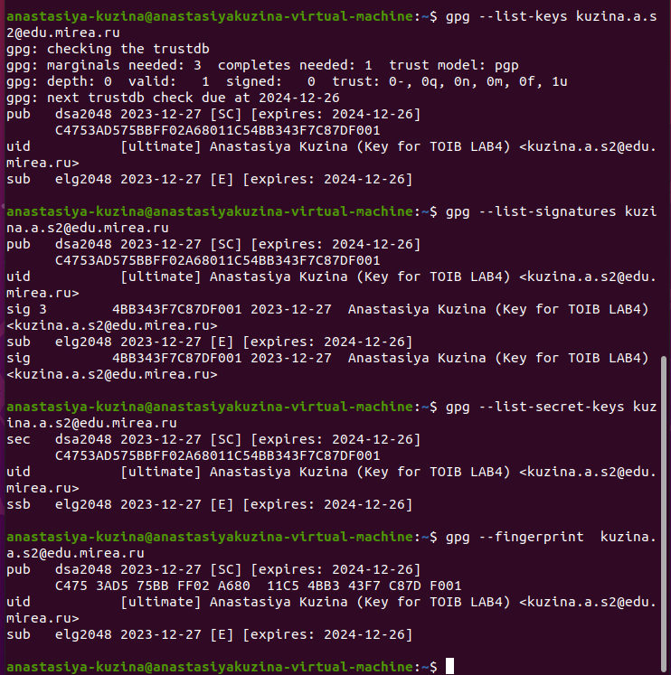
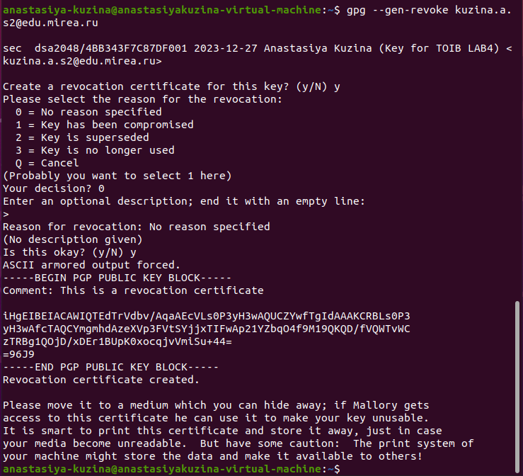
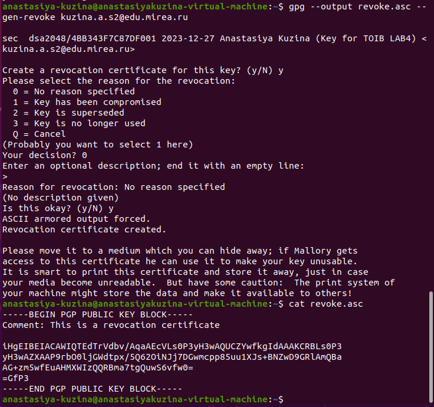
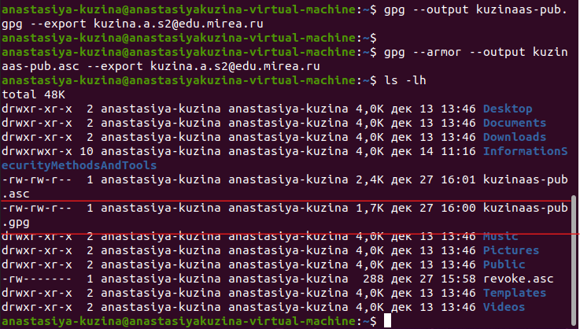
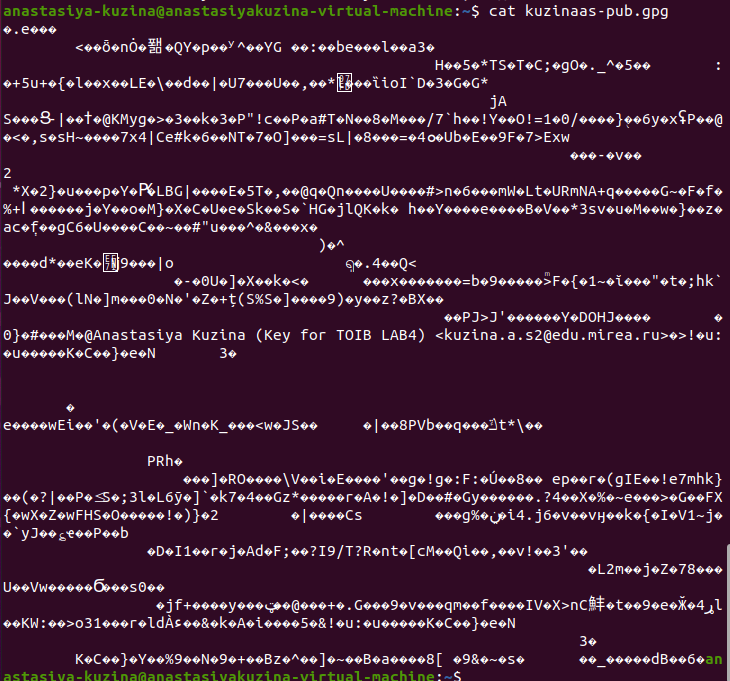
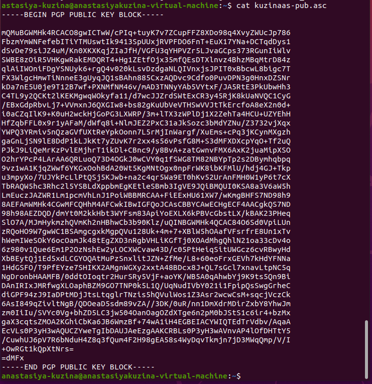
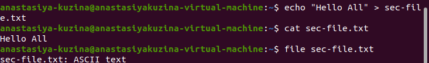

# Лабораторная работа №4. Настройка и применение криптографических протоколов

Выполнил(а) Кузина Анастасия Сергеевна, ББМО-02-23

## 1. Создание ключевой пары GPG

## 2. Просмотр созданных ключей, подписей, отпечатков

## 3. Создание отзывающего сертификата

3.1 Вывод сертификата в `stdout`:

3.2 Запись сертификата в файл: 

## 4. Экспорт публичного ключа в бинарном и текстовом виде

## 5. Создание файла для подписи

## 6. Создание цифровой подписи в бинарном виде

## Проверка подписи

## 7. Создание цифровой подписи в формате ASCII

## 8. Создание цифровой подписи, вставленной в содержимое файла

